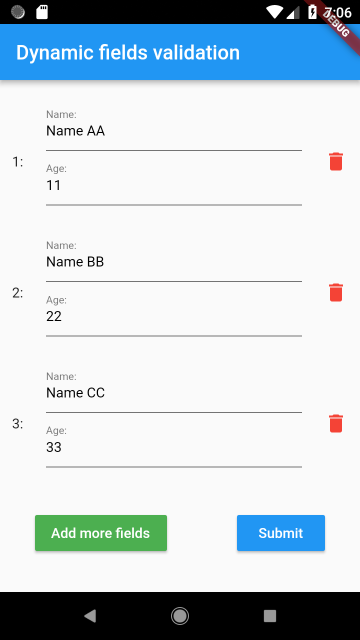

# Dynamic fields validation example

A Flutter example on how to validate dynamically created fields with the BLoC pattern and the [frideos](https://pub.dartlang.org/packages/frideos) package.

### Packages used:

- [Frideos-flutter](https://pub.dartlang.org/packages/frideos)

## Screenshots

